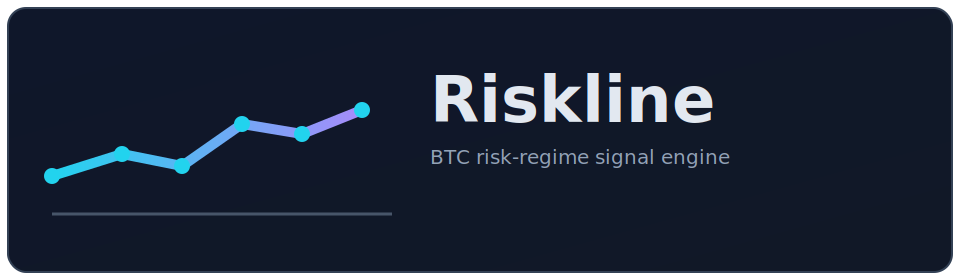

<p align="center">
  
</p>

# Riskline

**A BTC risk-regime monitoring engine that combines sentiment, trend, and futures positioning into actionable Telegram alerts.**

<p>
  
  
  
  
  
  
</p>

---

Riskline runs on a schedule (for example with cron or a systemd timer), computes a deterministic 0-100 risk score, maps that score to an action (`BUY` / `HOLD` / `REDUCE`), and sends notifications only when they matter.

## Features

- **Multi-signal scoring** from:
  - CoinMarketCap Fear & Greed Index
  - Binance spot daily candles (MA200 trend distance)
  - Binance futures funding + open interest
  - 24h volatility on daily closes
- **Deterministic risk score (0-100)** with explicit thresholds in `config.yaml`
- **Clear regime mapping**:
  - `EXTREME_FEAR_RISK_OFF`
  - `RISK_OFF_BUY_ZONE`
  - `NEUTRAL`
  - `RISK_ON_EUPHORIA`
- **Action guidance**:
  - `BUY` -> DCA buy / reduce leverage
  - `HOLD` -> hold spot / avoid overtrading
  - `REDUCE` -> take profits / reduce leverage
- **Anti-spam alerting** with state-aware gating:
  - first alert
  - regime flip
  - cooldown elapsed (default 6h)
- **Resilient HTTP client** with timeout + retries + exponential backoff
- **Dry-run mode** to print alerts instead of sending Telegram messages

## Quick Start

### 1) Prerequisites

- Python 3.9+
- CoinMarketCap API key
- Telegram bot token
- Telegram chat ID

### 2) Install

```bash
python3 -m venv .venv
source .venv/bin/activate
pip install -r requirements.txt
cp .env.example .env
```

### 3) Configure secrets

Set the following in `.env`:

```dotenv
CMC_API_KEY=your_cmc_key
TELEGRAM_BOT_TOKEN=your_bot_token
TELEGRAM_CHAT_ID=your_chat_id
RISKLINE_DRY_RUN=false
```

Set `RISKLINE_DRY_RUN=true` if you want to print messages locally instead of sending Telegram notifications.

### 4) Run once

```bash
.venv/bin/python main.py
```

## How It Works

Each run performs one full cycle:

1. Load runtime config + environment secrets
2. Load persisted state from `.riskline_state.json` (or configured path)
3. Fetch fresh market/sentiment inputs
4. Compute indicators:
   - MA200
   - % distance from MA200
   - daily return volatility
   - OI delta vs previous run
5. Compute score + regime + action guidance
6. Evaluate alert gate (`first_alert`, `regime_flip`, `cooldown_elapsed`, `cooldown_active`)
7. Send Telegram alert (or print in dry-run)
8. Persist updated state

## Configuration

Runtime settings live in `config.yaml`.

```yaml
poll_interval_minutes: 30
alert_cooldown_hours: 6
enable_liquidations_proxy: false

thresholds:
  fear_greed_buy: 20
  fear_greed_sell: 70
  funding_short_crowded: -0.0001
  funding_long_crowded: 0.0001
  trend_risk_off_pct: -1.0
  oi_deleveraging_pct: -2.0
  oi_leverage_build_pct: 2.0
  high_volatility_pct: 3.0

symbols:
  futures: BTCUSDT
  spot: BTCUSDT

http:
  timeout_seconds: 12
  max_retries: 3
  backoff_seconds: 1.0

state_file: .riskline_state.json
```

## Alert Example

```text
RISKLINE ALERT
Reason: regime_flip
Regime: RISK_OFF_BUY_ZONE | Score: 33
F&G: 19 (Extreme Fear)
BTC: 104,502.18 | vs 200D: -2.14%
Funding: -0.0123%/8h (Short crowded)
OI 24h proxy: -3.07% (Deleveraging)
Liq proxy: n/a
Action: DCA-BUY (3 tranches) / Reduce leverage
```

## Project Structure

```text
riskline/
├── main.py
├── config.yaml
├── riskline/
│   ├── config.py
│   ├── http.py
│   ├── state.py
│   ├── engine/
│   │   ├── score.py
│   │   ├── decision.py
│   │   └── format_message.py
│   ├── indicators/
│   │   ├── trend.py
│   │   └── volatility.py
│   ├── notify/
│   │   └── telegram.py
│   └── sources/
│       ├── cmc_fear_greed.py
│       ├── binance_spot.py
│       └── binance_futures.py
└── tests/
```

## Testing

Run test suite:

```bash
.venv/bin/python -m pytest -q
```

Covered areas include:

- indicator math
- score + decision boundaries
- state and cooldown behavior
- alert formatting
- source parsing and HTTP retry behavior
- orchestrator flow with mocks

## Deployment

Riskline is designed to run on a schedule.

### Option A: cron

Start from `scripts/cron_example.txt`.

### Option B: systemd timer (recommended)

1. Copy `systemd/riskline.service` -> `/etc/systemd/system/riskline.service`
2. Copy `systemd/riskline.timer` -> `/etc/systemd/system/riskline.timer`
3. Edit paths, user, and group
4. Enable and start:

```bash
sudo systemctl daemon-reload
sudo systemctl enable --now riskline.timer
sudo systemctl status riskline.timer
```

## Troubleshooting

- **429 / rate limits**: increase `poll_interval_minutes` and tune HTTP backoff/retries.
- **No Telegram messages**: verify bot token, chat ID, and bot permissions in target chat.
- **No alert triggered**: cooldown/regime gate can intentionally suppress duplicates.
- **Config error on startup**: check required env vars in `.env`.
- **Run failed due to network/API issues**: retry behavior is automatic, but persistent failures need API/network checks.

## Security

- Never commit `.env`
- Keep `CMC_API_KEY` and `TELEGRAM_BOT_TOKEN` private
- Keep alert destinations private when possible
- Treat state/config snapshots as potentially sensitive operational metadata

## Disclaimer

Riskline is a decision-support tool and does not provide financial advice.
